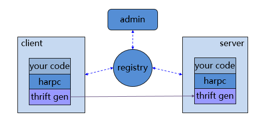
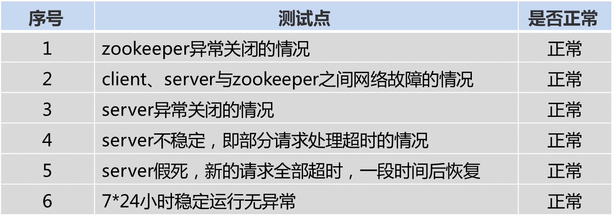
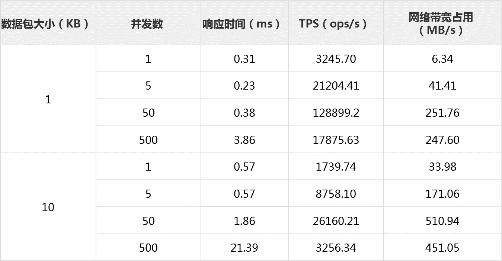

## harpc是什么
HARPC（High Availability RPC）是基于Thrift的跨语言、高可用的RPC框架。具备高性能、高可用、轻量级等特点，在百分点科技内部服务中广泛使用。

## 功能介绍

* 跨语言通信
    * 方便的使Java、Python、C++三种程序可以相互通信
* 负载均衡和容灾处理
    * 方便的实现任务的分布式处理
    * 支持服务的水平扩展，自动发现新的服务节点
    * 能够兼容各种异常情况，如节点的异常down机
* 可视化管理
    * 通过服务管理系统可以方便查看服务状态和统计信息
* 与原生thrift通信
    * 支持与原生thrift服务进行通信   

## 与业内方案的对比

* 与thrift、avro、hessian相比，harpc支持了高可用，并且更加易用
* 与dubbo相比，harpc支持了跨语言，并且更轻量级
* 与ice相比，harpc性能更高，并且更轻量级

## 设计思路
HARPC的核心思想是高可用，那么在保证高可用的基础上，还需要具备跨语言、高性能、可视化及轻量级等特性。于是，我们在设计之初就选择了基于thrift开发的方案，底层通信使用thrift来保证高性能和跨语言，然后HARPC来保证高可用和可视化，并且尽量保持简单，来达到轻量级的需求。

* 整体结构

   
    * 说明
        * 四个部分：client(客户端)、server(服务端)、registry（注册中心，目前为zookeeper集群）、admin(服务管理系统)
        * client和server又包括： your code(用户代码)、harpc(核心框架，包含Java、Python、C++三个版本）、thrift gen（thrift生成的源码文件，用于底层通信）

## 如何使用

* [java](java) 
* [python](python)
* [c++](cpp)

## 测试结论
harpc的Java、Python、C++版本的性能略有差别，由高到低为：C++版本 ≈ Java版本 > Python版本，下面仅给出Java版本的测试数据和结论。

* Java版本容错性测试

* Java版本性能测试
